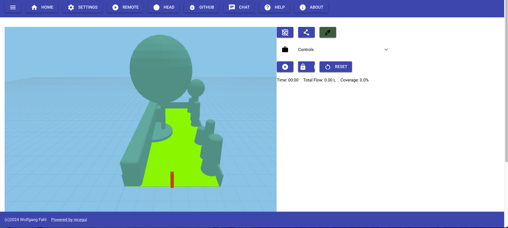
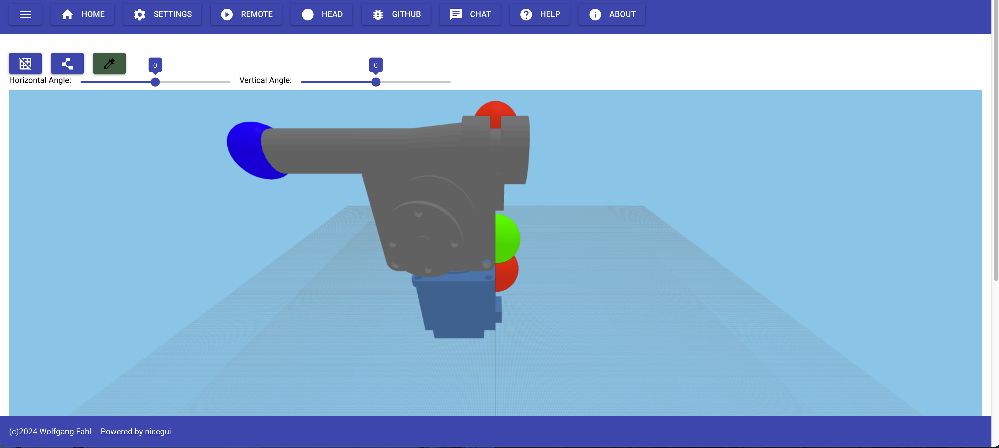

# nicesprinkler

Your lawn does not need a robot. It needs water in the right place.

[](https://pypi.org/project/nicesprinkler/)
[](https://github.com/WolfgangFahl/nicesprinkler/actions/workflows/build.yml)
[](https://pypi.python.org/pypi/nicesprinkler/)
[](https://github.com/WolfgangFahl/nicesprinkler/issues)
[](https://github.com/WolfgangFahl/nicesprinkler/issues/?q=is%3Aissue+is%3Aclosed)
[](https://WolfgangFahl.github.io/nicesprinkler/)
[](https://www.apache.org/licenses/LICENSE-2.0)

Two stepper motors, a garden hose and a Raspberry Pi. One motor turns,
the other lifts, and the jet lands where the software says it should —
if the software knows the truth about the garden. Getting it to know
that is the interesting part.

[▶ watch it run](https://download.bitplan.com/lawnsprinkler/20240811_sprinkler.mp4) — two minutes of the real machine watering a real lawn.



## What it does

- **Simulates** the throw over a 3D model of your garden before a drop falls
- **Aims** the head from the browser, or from a pattern
- **Watches** itself through the device camera while it works
- **Measures** its own flow with a bucket and a stopwatch, and remembers it



## Why the camera

A stepper says where it was told to go. Water pressure has opinions.
The hose bends, the head shifts under the jet, and the model drifts away
from the machine. So every frame the camera records is written with the
commanded angles beside it — pictures without angles teach nothing.

## Install

```bash
pip install nicesprinkler
```

## Run

```bash
sprinkler -s
```

Then open the address it prints. On a Raspberry Pi it drives the motors
through TB6600 drivers; anywhere else it runs the simulation with a mock
GPIO, so you can build the garden model on your laptop.

## Configure

Lawn size, head position, angle limits, hose specification and motor pins
live in one yaml. Start from `nicesprinkler_examples/example_config.yaml`.

## Documentation

- [API documentation](https://WolfgangFahl.github.io/nicesprinkler/)
- [Build instructions, parts list and wiring](https://wiki.bitplan.com/index.php/Lawn_Sprinkler)
- [Project page](https://wiki.bitplan.com/index.php/nicesprinkler)

## License

Apache 2.0
